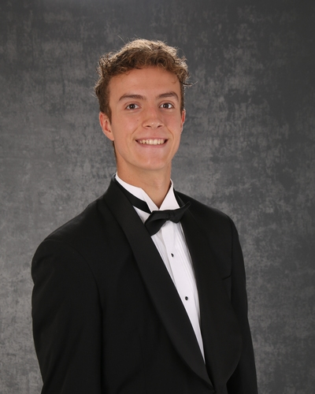

# **Luca Burns**
- Email: 776LAB@gmail.com
- Location: Houston, TX
- [LinkedIn Profile](https://www.linkedin.com/in/luca-burns-72ab1424b/)

##  **Education**
- MSc. Computational and Applied Math, Colorado School of Mines (2026)
- BSc. Engineering Physics, Colorado School of Mines (2025)

###  **Relevant Coursework**
- Senior Design Capstone, Scientific Computing, Advanced Physics Lab, Computer Science, Analog Electronics, Semiconductor Circuits - Digital, Electromagnetic Waves and Optics, Engineering Design

### **Honors**
- President's Scholarship Recipient, Mines Dean's List with Honors, Mines Swimming Hardest Worker

### **Membership**
- Mines Varsity Swim Team, Fellowship of Christian Athletes Leader

## **Relevant Experience**

### **Senior Design Capstone** - Geometric Modeling of Flagella in Single-Cell Organisms
- Developed novel mathematical equations for force, torque, power output, and propulsion for flagella interacting with the fluid, deriving equations of motion directly from geometric parameters such as curvature and torsion.
- Designed and implemented algorithms in Mathematica to map material frames to geometric frames, enabling advanced geometric modeling and analysis of flagellar dynamics

### **Physics Field Session TA** - Colorado School of Mines, Golden, CO
- Assisted 54 students in understanding and applying the Mathematica programming language to simulate physical phenomena and create mathematical models.
- Developed solutions to Mathematica lessons covering topics such as Lists and Functions, 3D-Plotting, Differentiation, Integration, Linear Algebra, Complex Analysis, Programming, Data Processing, and Optimization.
- Collaborated with the professor of the Mines Mathematical Physics course to enhance the curriculum by streamlining review material and incorporating new textbook content.

### **AMS Learning Center Tutor** - Colorado School of Mines, Golden, CO
- Tutored 12 students in differential equations and calculus, simplifying complex concecpts for comprehension.
- Interacted with students regularly to overcome learning challenges, ensuring their academic success evidenced by higher exam scores and an improved ability to solve problems with their own resources.

### **Physics Field Session Student** - Colorado School of Mines, Golden, CO
- Programmed in Mathematica for the application of computer interfacing systems and computational tools.
- Utilized electronics and instrumentation to create a working golf range finder and other devices.
- Constructed and aligned optical systems in teams of two for experiments including white light interferometer.
- Operated vacuum systems to ensure optimal experimental conditions for thin film deposition.
- Designed and fabriacted a telescope, using machined system components including CNC machines.

## **Skills**

### **Technical**
- Python, MATLAB, Jupyter Lab, Mathematica, LaTeX, Git, Bash, Algorithms, LabVIEW, Oscilloscopes, Lasers, Ellipsometers, Electron Microscopes, Sensor Systems, SolidWorks, Soldering, Gantt Charts, MS Office.
